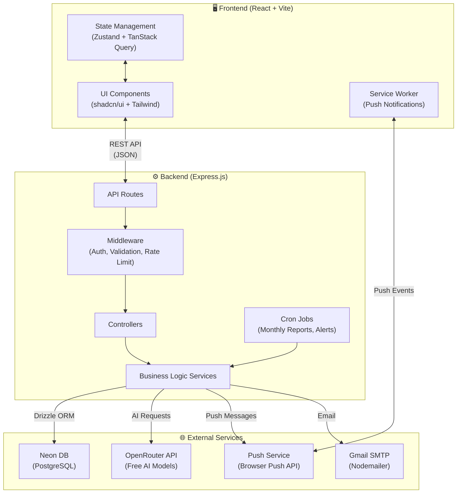
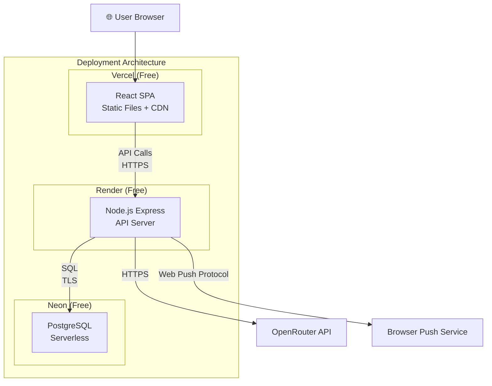

# 🏦 AI Personal Finance Assistant — Implementation Plan

## Overview

A full-stack AI-powered personal finance application that helps users manage money, optimize spending, and build long-term wealth. Built with the **PERN stack** (PostgreSQL/Neon, Express, React, Node.js), **Drizzle ORM**, **OpenRouter AI**, **Tailwind CSS**, and **shadcn/ui**.

**All technologies used are free-tier compatible.**

---

## 🛠 Technology Stack (All Free)

| Layer | Technology | Free Tier |
|:---|:---|:---|
| **Frontend** | React 18 + Vite + TypeScript | Open source |
| **Styling** | Tailwind CSS v4 + shadcn/ui | Open source |
| **Charts** | Recharts | Open source |
| **Backend** | Node.js + Express.js + TypeScript | Open source |
| **Database** | Neon (Serverless PostgreSQL) | 0.5 GB storage, 100 CU-hrs/mo |
| **ORM** | Drizzle ORM + Drizzle Kit | Open source |
| **AI** | OpenRouter (`openrouter/free` models) | Free models, ~50-200 req/day |
| **Auth** | JWT (jsonwebtoken + bcrypt) | Open source |
| **Notifications** | `web-push` (Web Push API + Service Workers) | Free (self-hosted) |
| **Email** | Nodemailer + Gmail SMTP | Free (500 emails/day) |
| **Validation** | Zod (shared between client & server) | Open source |
| **State Mgmt** | Zustand + TanStack Query | Open source |
| **Deployment** | Vercel (frontend) + Render (backend) | Free tiers |

---

## 📁 File Architecture

> [!NOTE]
> **Simple flat structure** — no Turborepo, no monorepo workspaces. `client/` and `server/` are two independent projects, each with their own `package.json` and `node_modules`. Shared types are manually kept in sync (server is the source of truth).

```
e:\Projects\fintech\
├── .gitignore
├── README.md
│
├── server/                         # Express.js Backend
│   ├── package.json
│   ├── tsconfig.json
│   ├── drizzle.config.ts           # Drizzle Kit config
│   ├── .env                        # Server environment vars
│   ├── drizzle/                    # Generated migrations
│   │   └── migrations/
│   └── src/
│       ├── index.ts                # Server entry point
│       ├── app.ts                  # Express app setup
│       ├── db/
│       │   ├── index.ts            # Drizzle + Neon client
│       │   ├── schema/
│       │   │   ├── index.ts        # Re-exports all schemas
│       │   │   ├── users.ts
│       │   │   ├── profiles.ts
│       │   │   ├── transactions.ts
│       │   │   ├── categories.ts
│       │   │   ├── budgets.ts
│       │   │   ├── budget-items.ts
│       │   │   ├── investments.ts
│       │   │   ├── goals.ts
│       │   │   ├── notifications.ts
│       │   │   ├── push-subscriptions.ts
│       │   │   └── ai-conversations.ts
│       │   └── seed.ts             # Seed data (default categories)
│       ├── types/                  # Shared types (SOURCE OF TRUTH)
│       │   ├── index.ts
│       │   ├── user.ts
│       │   ├── transaction.ts
│       │   ├── budget.ts
│       │   ├── investment.ts
│       │   ├── goal.ts
│       │   ├── notification.ts
│       │   └── ai.ts
│       ├── validation/             # Zod schemas (server-side)
│       │   ├── auth.schema.ts
│       │   ├── profile.schema.ts
│       │   ├── transaction.schema.ts
│       │   ├── budget.schema.ts
│       │   ├── goal.schema.ts
│       │   └── index.ts
│       ├── routes/
│       │   ├── index.ts            # Route aggregator
│       │   ├── auth.routes.ts
│       │   ├── profile.routes.ts
│       │   ├── transaction.routes.ts
│       │   ├── budget.routes.ts
│       │   ├── investment.routes.ts
│       │   ├── goal.routes.ts
│       │   ├── ai.routes.ts
│       │   ├── notification.routes.ts
│       │   └── dashboard.routes.ts
│       ├── controllers/
│       │   ├── auth.controller.ts
│       │   ├── profile.controller.ts
│       │   ├── transaction.controller.ts
│       │   ├── budget.controller.ts
│       │   ├── investment.controller.ts
│       │   ├── goal.controller.ts
│       │   ├── ai.controller.ts
│       │   ├── notification.controller.ts
│       │   └── dashboard.controller.ts
│       ├── services/
│       │   ├── ai.service.ts        # OpenRouter integration
│       │   ├── budget.service.ts    # Budget calculation logic
│       │   ├── insight.service.ts   # Financial insights engine
│       │   ├── health-score.service.ts  # Financial health scoring
│       │   ├── notification.service.ts  # Push notification logic
│       │   └── email.service.ts     # Email sending logic
│       ├── middleware/
│       │   ├── auth.middleware.ts    # JWT verification
│       │   ├── validate.middleware.ts # Zod validation
│       │   ├── rate-limit.middleware.ts
│       │   └── error.middleware.ts   # Global error handler
│       ├── utils/
│       │   ├── constants.ts         # Country data, categories
│       │   ├── calculations.ts      # Financial math utilities
│       │   └── logger.ts
│       └── cron/
│           ├── index.ts             # Cron job scheduler
│           ├── monthly-report.ts    # Monthly financial report
│           └── budget-alerts.ts     # Budget limit alerts
│
├── client/                         # React + Vite Frontend
│   ├── package.json
│   ├── tsconfig.json
│   ├── tsconfig.app.json
│   ├── vite.config.ts
│   ├── components.json             # shadcn/ui config
│   ├── index.html
│   ├── public/
│   │   ├── sw.js                   # Service Worker (push notifications)
│   │   ├── manifest.json           # PWA manifest
│   │   └── icons/                  # App icons
│   └── src/
│       ├── main.tsx                # Entry point
│       ├── App.tsx                 # Root component + router
│       ├── index.css               # Tailwind imports + globals
│       ├── types/                  # Shared types (copy from server)
│       │   ├── index.ts
│       │   ├── user.ts
│       │   ├── transaction.ts
│       │   ├── budget.ts
│       │   ├── investment.ts
│       │   ├── goal.ts
│       │   ├── notification.ts
│       │   └── ai.ts
│       ├── lib/
│       │   ├── utils.ts            # shadcn/ui utility (cn)
│       │   ├── api.ts              # Axios/fetch client setup
│       │   └── format.ts           # Currency/date formatters
│       ├── hooks/
│       │   ├── use-auth.ts
│       │   ├── use-transactions.ts
│       │   ├── use-budget.ts
│       │   ├── use-goals.ts
│       │   ├── use-ai-chat.ts
│       │   ├── use-notifications.ts
│       │   └── use-dashboard.ts
│       ├── stores/
│       │   ├── auth.store.ts       # Zustand auth store
│       │   ├── ui.store.ts         # Theme, sidebar state
│       │   └── notification.store.ts
│       ├── components/
│       │   ├── ui/                 # shadcn/ui components
│       │   │   ├── button.tsx
│       │   │   ├── card.tsx
│       │   │   ├── input.tsx
│       │   │   ├── dialog.tsx
│       │   │   ├── sheet.tsx
│       │   │   ├── toast.tsx
│       │   │   ├── tabs.tsx
│       │   │   ├── badge.tsx
│       │   │   ├── progress.tsx
│       │   │   ├── table.tsx
│       │   │   ├── chart.tsx        # Recharts wrapper
│       │   │   └── ... (other shadcn components)
│       │   ├── layout/
│       │   │   ├── app-layout.tsx   # Main app shell
│       │   │   ├── sidebar.tsx      # Navigation sidebar
│       │   │   ├── header.tsx       # Top bar (search, notifications, profile)
│       │   │   ├── mobile-nav.tsx   # Mobile navigation
│       │   │   └── theme-toggle.tsx
│       │   ├── dashboard/
│       │   │   ├── stats-cards.tsx       # Key financial metrics
│       │   │   ├── spending-chart.tsx    # Spending over time
│       │   │   ├── category-breakdown.tsx # Pie/donut chart
│       │   │   ├── budget-progress.tsx   # Budget utilization bars
│       │   │   ├── recent-transactions.tsx
│       │   │   ├── health-score-ring.tsx  # Animated score ring
│       │   │   └── ai-insights-card.tsx   # Quick AI insights
│       │   ├── transactions/
│       │   │   ├── transaction-list.tsx
│       │   │   ├── transaction-form.tsx
│       │   │   ├── transaction-filters.tsx
│       │   │   └── import-csv.tsx        # CSV import
│       │   ├── budget/
│       │   │   ├── budget-overview.tsx
│       │   │   ├── budget-form.tsx
│       │   │   ├── salary-breakdown.tsx   # 50/30/20 visualization
│       │   │   └── budget-comparison.tsx  # Budget vs actual
│       │   ├── investments/
│       │   │   ├── investment-list.tsx
│       │   │   ├── investment-form.tsx
│       │   │   └── portfolio-chart.tsx
│       │   ├── goals/
│       │   │   ├── goal-list.tsx
│       │   │   ├── goal-form.tsx
│       │   │   ├── goal-progress.tsx      # Visual progress tracker
│       │   │   └── goal-timeline.tsx
│       │   ├── ai/
│       │   │   ├── ai-chat.tsx           # Chat interface
│       │   │   ├── ai-message.tsx        # Message bubble
│       │   │   ├── ai-suggestions.tsx    # Prompt suggestions
│       │   │   └── financial-report.tsx  # AI-generated report
│       │   ├── notifications/
│       │   │   ├── notification-center.tsx  # Dropdown notifications
│       │   │   ├── notification-item.tsx
│       │   │   └── notification-settings.tsx
│       │   └── auth/
│       │       ├── login-form.tsx
│       │       ├── register-form.tsx
│       │       └── protected-route.tsx
│       └── pages/
│           ├── landing.tsx          # Public landing page
│           ├── login.tsx
│           ├── register.tsx
│           ├── dashboard.tsx
│           ├── transactions.tsx
│           ├── budget.tsx
│           ├── investments.tsx
│           ├── goals.tsx
│           ├── ai-advisor.tsx       # AI chat page
│           ├── reports.tsx          # Monthly/yearly reports
│           ├── settings.tsx         # Profile, notifications, preferences
│           └── not-found.tsx
│
└── docs/
    └── api.md                      # API documentation
```

### Type Sharing Strategy

Since there's no monorepo, types are shared manually:

| Concern | Approach |
|:---|:---|
| **Source of truth** | `server/src/types/` — all TypeScript interfaces/types live here |
| **Client copy** | `client/src/types/` — manually kept in sync (copy when server types change) |
| **Validation (Zod)** | Server-only (`server/src/validation/`) — client uses simple form validation |
| **API contracts** | Types define request/response shapes; both sides import their local copy |

---

## 🗄 Database Schema Design (Drizzle ORM)

### Entity Relationship Diagram

```mermaid
erDiagram
    USERS ||--|| PROFILES : has
    USERS ||--o{ TRANSACTIONS : records
    USERS ||--o{ BUDGETS : creates
    USERS ||--o{ GOALS : sets
    USERS ||--o{ INVESTMENTS : tracks
    USERS ||--o{ NOTIFICATIONS : receives
    USERS ||--o{ PUSH_SUBSCRIPTIONS : subscribes
    USERS ||--o{ AI_CONVERSATIONS : initiates
    BUDGETS ||--o{ BUDGET_ITEMS : contains
    CATEGORIES ||--o{ TRANSACTIONS : classifies
    CATEGORIES ||--o{ BUDGET_ITEMS : allocates

    USERS {
        uuid id PK
        string email UK
        string password_hash
        timestamp created_at
        timestamp updated_at
    }

    PROFILES {
        uuid id PK
        uuid user_id FK
        string full_name
        string profession
        string country
        string currency
        decimal monthly_salary
        decimal current_savings
        enum risk_tolerance "low|medium|high"
        jsonb financial_goals
        timestamp updated_at
    }

    CATEGORIES {
        serial id PK
        string name
        enum type "need|want|saving|investment"
        string icon
        string color
        boolean is_default
    }

    TRANSACTIONS {
        uuid id PK
        uuid user_id FK
        int category_id FK
        decimal amount
        enum type "income|expense"
        string description
        date transaction_date
        boolean is_recurring
        string recurrence_period "monthly|weekly|yearly"
        timestamp created_at
    }

    BUDGETS {
        uuid id PK
        uuid user_id FK
        string name
        decimal total_amount
        int month
        int year
        enum strategy "50_30_20|custom"
        timestamp created_at
    }

    BUDGET_ITEMS {
        uuid id PK
        uuid budget_id FK
        int category_id FK
        decimal allocated_amount
        decimal spent_amount
        decimal percentage
    }

    INVESTMENTS {
        uuid id PK
        uuid user_id FK
        string name
        enum type "stocks|etf|mutual_fund|retirement|crypto|other"
        decimal invested_amount
        decimal current_value
        date start_date
        string platform
        text notes
        timestamp updated_at
    }

    GOALS {
        uuid id PK
        uuid user_id FK
        string title
        string description
        decimal target_amount
        decimal current_amount
        decimal monthly_contribution
        date target_date
        enum priority "high|medium|low"
        enum status "active|completed|paused"
        timestamp created_at
    }

    NOTIFICATIONS {
        uuid id PK
        uuid user_id FK
        string title
        text message
        enum type "budget_alert|goal_milestone|insight|reminder|system"
        boolean is_read
        jsonb metadata
        timestamp created_at
    }

    PUSH_SUBSCRIPTIONS {
        uuid id PK
        uuid user_id FK
        jsonb subscription
        boolean is_active
        timestamp created_at
    }

    AI_CONVERSATIONS {
        uuid id PK
        uuid user_id FK
        jsonb messages
        string context_type "general|budget|investment|goal"
        timestamp created_at
        timestamp updated_at
    }
```



---

## 🔄 Data Flow Architecture



### Key Data Flows

#### 1. User Onboarding Flow
```
Register → Create Profile (salary, country, profession)
  → AI generates initial salary breakdown (50/30/20)
  → Auto-create default budget
  → Welcome notification
```

#### 2. Transaction Recording Flow
```
User adds transaction → Validate with Zod
  → Save to DB → Update budget spent amounts
  → Check if budget limit exceeded
    → Yes: Send push notification + in-app alert
  → Recalculate financial health score
```

#### 3. AI Advisory Flow
```
User sends message → Attach context (profile, recent transactions, budgets)
  → Send to OpenRouter API (system prompt + user data)
  → Stream response back to client
  → Save conversation to DB
  → Extract actionable insights → Create notifications
```

#### 4. Monthly Report Flow (Cron)
```
1st of month → Aggregate previous month data
  → Calculate: total income, expenses, savings rate
  → Compare with budget → Generate variance report
  → AI generates monthly insights
  → Send push notification + email summary
  → Create new month's budget (carry forward)
```

---

## 🏗 System Design



### Security Architecture

| Concern | Solution |
|:---|:---|
| **Authentication** | JWT access tokens (15min) + refresh tokens (7d) stored in httpOnly cookies |
| **Password Storage** | bcrypt with 12 salt rounds |
| **API Security** | CORS whitelist, Helmet.js, rate limiting (100 req/15min) |
| **Data Validation** | Zod schemas on server; client-side form validation via react-hook-form |
| **SQL Injection** | Drizzle ORM parameterized queries (built-in) |
| **XSS Protection** | React auto-escaping + Content-Security-Policy headers |
| **HTTPS** | Enforced by Vercel & Render |

### Performance Considerations

- **Neon Cold Starts**: Mitigated by connection pooling and keep-alive pings
- **OpenRouter Rate Limits**: Client-side debouncing + server-side queue with retry
- **Render Free Tier Sleep**: Keep-alive cron via UptimeRobot (free)
- **Data Caching**: TanStack Query with stale-while-revalidate for dashboard data
- **Bundle Size**: Vite code splitting + lazy-loaded routes

---

## 📋 Feature Breakdown

### Phase 1 — Core Foundation
1. Project setup (`client/` + `server/` independent dirs, configs, tooling)
2. Database schema + migrations
3. Auth system (register, login, JWT)
4. User profile & onboarding
5. App shell layout (sidebar, header, responsive)

### Phase 2 — Financial Management
6. Transaction CRUD + CSV import
7. Category management
8. Budget creation (50/30/20 + custom)
9. Budget vs. actual tracking
10. Dashboard with charts & stats

### Phase 3 — AI & Intelligence
11. OpenRouter AI integration
12. AI Chat interface
13. Salary distribution advisor
14. Financial insights engine
15. Financial health score calculator

### Phase 4 — Goals & Investments
16. Financial goals CRUD + progress tracking
17. Goal timeline visualization
18. Investment portfolio tracker
19. Investment recommendations (AI-powered)

### Phase 5 — Notifications & Polish
20. Web Push notifications (service worker)
21. In-app notification center
22. Email notifications (monthly summaries)
23. Budget alert system (cron jobs)
24. Reports page (monthly/yearly)

### Phase 6 — Landing & Deployment
25. Landing page (public marketing page)
26. PWA manifest + offline support
27. Deployment (Vercel + Render + Neon)
28. API documentation

---

## 🔑 API Design

### Authentication
| Method | Endpoint | Description |
|:---|:---|:---|
| POST | `/api/auth/register` | Register new user |
| POST | `/api/auth/login` | Login, returns JWT |
| POST | `/api/auth/refresh` | Refresh access token |
| POST | `/api/auth/logout` | Invalidate refresh token |

### Profile
| Method | Endpoint | Description |
|:---|:---|:---|
| GET | `/api/profile` | Get user profile |
| PUT | `/api/profile` | Update profile |
| POST | `/api/profile/onboarding` | Complete onboarding |

### Transactions
| Method | Endpoint | Description |
|:---|:---|:---|
| GET | `/api/transactions` | List (paginated, filterable) |
| POST | `/api/transactions` | Create transaction |
| PUT | `/api/transactions/:id` | Update transaction |
| DELETE | `/api/transactions/:id` | Delete transaction |
| POST | `/api/transactions/import` | Import from CSV |
| GET | `/api/transactions/summary` | Monthly summary stats |

### Budget
| Method | Endpoint | Description |
|:---|:---|:---|
| GET | `/api/budgets` | Get budgets |
| POST | `/api/budgets` | Create budget |
| PUT | `/api/budgets/:id` | Update budget |
| GET | `/api/budgets/:id/comparison` | Budget vs actual |
| POST | `/api/budgets/auto-generate` | AI-generated budget from salary |

### Goals
| Method | Endpoint | Description |
|:---|:---|:---|
| GET | `/api/goals` | List goals |
| POST | `/api/goals` | Create goal |
| PUT | `/api/goals/:id` | Update goal |
| DELETE | `/api/goals/:id` | Delete goal |
| POST | `/api/goals/:id/contribute` | Add contribution |

### Investments
| Method | Endpoint | Description |
|:---|:---|:---|
| GET | `/api/investments` | List investments |
| POST | `/api/investments` | Add investment |
| PUT | `/api/investments/:id` | Update investment |
| DELETE | `/api/investments/:id` | Delete investment |
| GET | `/api/investments/summary` | Portfolio summary |

### AI Advisor
| Method | Endpoint | Description |
|:---|:---|:---|
| POST | `/api/ai/chat` | Send message, get AI response |
| GET | `/api/ai/conversations` | List conversations |
| GET | `/api/ai/conversations/:id` | Get conversation |
| POST | `/api/ai/insights` | Generate financial insights |
| POST | `/api/ai/salary-breakdown` | Get AI salary distribution |

### Dashboard
| Method | Endpoint | Description |
|:---|:---|:---|
| GET | `/api/dashboard/overview` | Summary stats |
| GET | `/api/dashboard/health-score` | Financial health score |
| GET | `/api/dashboard/spending-trends` | Spending trends data |

### Notifications
| Method | Endpoint | Description |
|:---|:---|:---|
| GET | `/api/notifications` | List notifications |
| PUT | `/api/notifications/:id/read` | Mark as read |
| PUT | `/api/notifications/read-all` | Mark all read |
| POST | `/api/notifications/subscribe` | Subscribe to push |
| DELETE | `/api/notifications/unsubscribe` | Unsubscribe from push |

---

## 🎨 UI Design System

### Color Palette (Dark Mode Primary)
```css
/* Finance-themed palette */
--background:      hsl(222, 47%, 6%)       /* Deep navy */
--card:            hsl(222, 40%, 9%)       /* Card surface */
--primary:         hsl(142, 71%, 45%)      /* Money green */
--primary-accent:  hsl(142, 65%, 55%)      /* Lighter green */
--destructive:     hsl(0, 84%, 60%)        /* Expense red */
--warning:         hsl(38, 92%, 50%)       /* Amber warning */
--chart-1:         hsl(210, 100%, 60%)     /* Blue */
--chart-2:         hsl(142, 71%, 45%)      /* Green */
--chart-3:         hsl(280, 65%, 60%)      /* Purple */
--chart-4:         hsl(38, 92%, 50%)       /* Amber */
--chart-5:         hsl(340, 75%, 55%)      /* Pink */
```

### Key UI Components
- **Glassmorphism cards** with subtle backdrop blur
- **Animated counters** for financial metrics
- **Gradient progress bars** for budgets/goals
- **Animated donut/ring chart** for health score
- **Smooth page transitions** with Framer Motion
- **Skeleton loaders** for data fetching states
- **Toast notifications** for real-time alerts

### Pages

| Page | Key Visuals |
|:---|:---|
| **Landing** | Hero with gradient, feature cards with icons, testimonials |
| **Dashboard** | 4 stat cards, spending line chart, category donut, budget bars, health ring |
| **Transactions** | Data table with filters, category badges, CSV import dialog |
| **Budget** | 50/30/20 visual breakdown, stacked bar chart, budget vs actual |
| **Goals** | Goal cards with progress rings, timeline visualization |
| **AI Advisor** | Chat interface with markdown support, prompt suggestions |
| **Reports** | Monthly summary, year-over-year comparison, downloadable |
| **Settings** | Profile form, notification preferences, theme toggle |

---

## ⚠️ Install Notes

> [!WARNING]
> **drizzle-orm peer dependency conflict**: `drizzle-orm` has optional peer deps on `react-native` / `expo-sqlite` which conflict with React 18. Install in the **server/** directory (not root) to avoid conflicts:
> ```bash
> cd server
> npm i drizzle-orm @neondatabase/serverless dotenv
> npm i -D drizzle-kit tsx
> ```
> If you still get conflicts, use `npm i --legacy-peer-deps`.

---

## User Review Required

> [!IMPORTANT]  
> **Authentication**: The plan uses JWT-based auth (free, no external service). Would you prefer a third-party auth like Clerk or Auth0 (both have free tiers but add complexity)?

> [!WARNING]
> **OpenRouter Free Tier**: Free models have ~50-200 requests/day. For a personal finance app this should be sufficient for individual use but won't scale. Is this acceptable?

> [!IMPORTANT]
> **Tailwind CSS Version**: shadcn/ui works best with Tailwind CSS v4 (using `@tailwindcss/vite` plugin). Confirming you want **Tailwind v4**?

---

## Open Questions

1. **Dark mode only or light/dark toggle?** The plan includes a toggle but defaults to dark.
2. **Currency support**: Should we support multi-currency or stick to user's country currency?
3. **Do you want email verification** on registration, or simple register-and-go?
4. **Any specific country** you want me to prioritize for localization defaults (tax rules, investment options)?

---

## Verification Plan

### Automated Tests
```bash
# Server - API tests
cd server && npm test

# Client - Component tests
cd client && npm test

# Type checking
npm run typecheck

# Lint
npm run lint
```

### Manual Verification
- Register → Onboarding → Dashboard flow
- Add transactions → Budget tracking updates
- AI chat with financial context
- Push notification delivery
- Responsive design on mobile
- Full deployment smoke test on Vercel + Render
